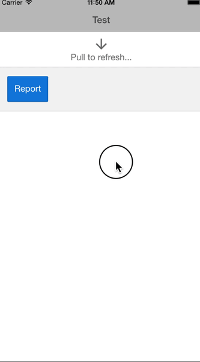

# Narwhals Client

Capital One Hackathon, March 2015


## Prerequisites

* npm
* Xcode (for iOS platform)
* gulp
* bower
* Apache Cordova (``$ npm install --global cordova``)
* iOS Simulator (``$ npm install --global ios-sim``)


## Getting started

### Install ionic

````bash
    $ npm install --global ionic
````


### Clone the Repository

````bash
    $ git clone git@github.com:mickaelpham/narwhals_client.git && cd narwhals_client
````

### Install NPM dependencies

````bash
    $ npm install 
````


### Install bower dependencies

````bash
    $ bower install
````


### Run
Given you have a [proper browser](https://www.google.com/chrome/) installed, you can start right away

````bash
    $ ionic serve
````


    